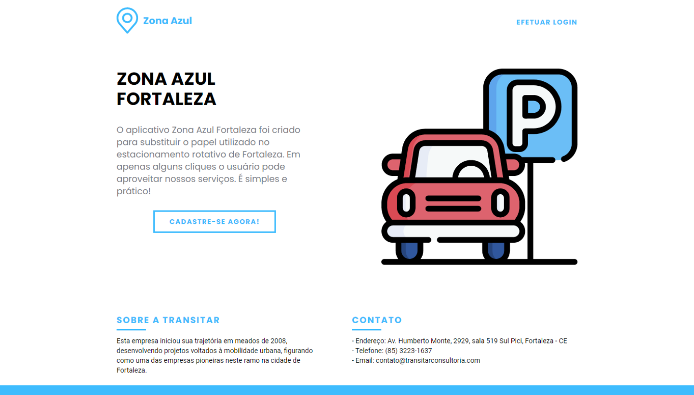

<h1 align="center">
    
</h1>

  <a href="#-projeto">Projeto</a>&nbsp;&nbsp;&nbsp;|&nbsp;&nbsp;&nbsp;
  <a href="#-tecnologias">Tecnologias</a>

  

## 💻 Projeto

O Zona Azul Fortaleza é uma aplicação web que realiza as principais operações do serviço (CRUD) de forma dinâmica utilizando a Fetch API.

## 🔧 Tecnologias

Esse projeto foi desenvolvido utilizando HTML, CSS e JS Puro.
